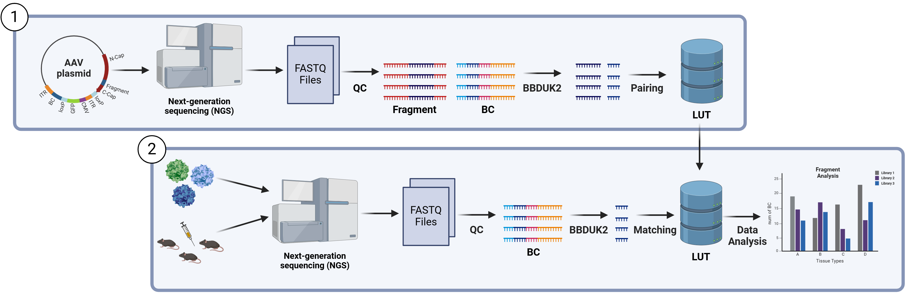

# Data Processing Pipeline for AAV Libraries and Tissue Samples

This Git repository contains all the code and notebooks used to process raw Illumina short-read data into a format suitable for data analysis and machine learning tasks conducted during my Master's thesis project at rAAven Therapeutics.

The pipeline analyzes sequencing data from both the initial plasmid AAV library and tissue samples collected from model organisms injected with that library. This allows for the identification of recombinant AAV variants present in different cell types and tissues.

It is designed to work with both rationally designed libraries, which are based on a provided reference protein sequence file, and with randomly generated libraries, such as NNK libraries or other codon-randomized designs, making it adaptable to a wide range of AAV library formats.



*Simplified illustration of the pipeline generating a look-up table (LUT) to map barcodes to fragment insertions, enabling variant identification across cell types.*

**Note:** For better organization, each directory contains its own dedicated README file describing its contents and purpose.

---

## Table of Contents
- [Data Processing Pipeline for AAV Libraries and Tissue Samples](#data-processing-pipeline-for-aav-libraries-and-tissue-samples)
  - [Table of Contents](#table-of-contents)
  - [Prerequisites](#prerequisites)
  - [Installation](#installation)
    - [Installing Anaconda](#installing-anaconda)
    - [Setting Up the Conda Environment](#setting-up-the-conda-environment)
    - [Installing BBmap](#installing-bbmap)
  - [Running the Pipeline](#running-the-pipeline)
    - [The Data](#the-data)
      - [Required Files](#required-files)
        - [Illumina Read FASTQ Files](#illumina-read-fastq-files)
        - [Additional Files](#additional-files)
        - [Example-Directory](#example-directory)
    - [The Config File](#the-config-file)
    - [Start the Pipeline](#start-the-pipeline)
      - [Alternative way to run the pipeline](#alternative-way-to-run-the-pipeline)
      - [Running the Pipeline on an HPC](#running-the-pipeline-on-an-hpc)
  - [Workflow of the Pipeline](#workflow-of-the-pipeline)
      - [**Step 1: Fragment Generation and Translation**](#step-1-fragment-generation-and-translation)
      - [**Step 2: Barcode and Fragment Extraction**](#step-2-barcode-and-fragment-extraction)
      - [**Step 3: Barcode Reduction and Classification**](#step-3-barcode-reduction-and-classification)
      - [**Step 4: Sample Barcode Processing**](#step-4-sample-barcode-processing)
      - [**Step 5: Data Merging**](#step-5-data-merging)
      - [**Step 6: Final Dataset Processing and Normalization**](#step-6-final-dataset-processing-and-normalization)
  - [Data Visualisation](#data-visualisation)
  - [License](#license)
  - [Acknowledgments](#acknowledgments)
  - [Contact Information](#contact-information)

---

## Prerequisites

Before running the tool, ensure the following software and libraries are installed:

- **Anaconda** (version 24.1.2)
- **BBmap** (version 39.08)

---

## Installation

### Installing Anaconda

If you don't have Anaconda installed, you can download and install it by following these steps:

1. Visit the [official Anaconda website](https://www.anaconda.com/products/distribution).
2. Download the installer for your operating system (Windows, macOS, or Linux).
3. Follow the installation instructions provided for your platform.
4. After installation, you can verify that Anaconda is installed correctly by running:

```bash
conda --version
```

If you see a version number 24.1.2, Anaconda is ready to use.

### Setting Up the Conda Environment

To run the pipeline, you must set up a Conda environment using the provided `pipeline.yml` file in the `envs/` directory. This can be done with the following command:

```bash
conda env create -f envs/pipeline.yml
```

**Note:** Dependencies can also be installed using a virtual environment (venv) with `pip` or manually, but Conda is recommended for consistency.

### Installing BBmap

The pipeline uses the `bbduk2` tool from the BBmap suite to extract DNA sequences from reads based on a left and a right literal. Follow these steps to install and configure BBmap:

1. Clone the BBmap repository:

```bash
   git clone https://github.com/BioInfoTools/BBMap.git
```

**or**
Download the zip file from their official website: https://sourceforge.net/projects/bbmap/

2. Navigate to the BBmap directory and ensure bbduk2 is executable:

```bash
cd BBMap
chmod +x bbduk.sh
export PATH=$PATH:$(pwd)
```

3. Verify the installation:

```bash
./bbduk2.sh --version
```

The version used in our pipeline is 39.08

**Note:** Add the BBmap directory to your PATH in your shell configuration file (e.g., .bashrc or .zshrc) to avoid repeating the export command.

---

## Running the Pipeline

### The Data

Since proprietary data from rAAven Therapeutics cannot be published, a folder named `Example/` is provided with small example files for demonstration purposes.

#### Required Files

##### Illumina Read FASTQ Files

- DNA Sequencing of paired-end reads to identify and match barcodes with their corresponding fragments from the Plasmid Library.
- RNA Sequencing of barcode reads from the Plasmid Library after DNAse treatment to determine which variants successfully formed capsids.
- RNA Sequencing of barcode reads from tissue samples to analyze the presence of AAV variants across different cell and tissue types.

##### Additional Files

1. **Reference Sequences**:
   - If the library was rationally designed which means based on known protein sequences, include a reference sequence file: `reference_seq.fasta`.

2. **Codon Usage File**:
   - `wSet.csv`: This file contains codon usage frequencies optimized for *Homo sapiens*.
   It is essential because different organisms prefer different codons to encode the same amino acid. To ensure that the reference protein sequences are optimized for human expression, the pipeline uses this file to replace the original codons with the ones most commonly used in humans.


3. **Load List**:
   - `loadlist.csv`: : A reference file that links tissue/sample FASTQ filenames to their respective tissue groups. This mapping is essential in Step 4 of the pipeline to ensure barcodes are extracted from the correct samples.

##### Example-Directory

Below is an overview of how the files described above are organized and named in the provided example directory. These files serve as a template for how your own input data should be structured.

- **Paired-end reads**:
  - `Example/fastq_files/R1.fastq.gz`
  - `Example/fastq_files/R2.fastq.gz`
- **AAV capsid and tissue reads**:
  - `Example/sample_fastq/AAV23_R1.fastq.gz`
  - `Example/sample_fastq/Tissue1.fastq.gz`
  - `Example/sample_fastq/Tissue2.fastq.gz`

- **Additional Files**:
  - `Example/input/load_list.csv`
  - `Example/input/reference_seq.fasta`
  - `Example/input/wSet.csv`

### The Config File

Before running the pipeline, you must customize the configuration file. The config file is a Python script that contains dictionaries defining all the necessary parameters for each step of the pipeline.

Configuration files are stored in the `configs/` subdirectory. This folder includes all the config files used for different plasmid libraries in our analysis.

Each plasmid library can have different library identifiers, linker sequences, or structural variations. Therefore, it is essential to adapt the configuration file to match your specific library setup.

For the provided example data, you can use the preconfigured file: `configs/config_Example.py`.

**Note:** Detailed parameter explanations are available in `configs/README.md`.

### Start the Pipeline

After configuring the settings file and ensuring all parameters are correctly defined, the pipeline can be initiated. The most straightforward method to execute it is by running the run_pipeline.sh script as follows:

```bash
./Bash_scripts/run_pipeline.sh configs/example_config.py
```

If running the pipeline with an NNK library instead of a rationally designed library with a reference, the code can be executed as follows:

```bash
./Bash_scripts/run_pipeline.sh configs/example_config.py -nnk True
```

This ensures that Steps 2, 3, and 6 of the pipeline are executed according to the design of an NNK library.

#### Alternative way to run the pipeline

The pipeline can of cause also be run individually by simply running the individual python scripts

```bash
./Python_Scripts/S1.py
./Python_Scripts/S2.py (S2_NNK.py)
./Python_Scripts/S3.py (S3_NNK.py)
./Python_Scripts/S4.py
./Python_Scripts/S5.py
./Python_Scripts/S6.py (S6_NNK.py)
```

#### Running the Pipeline on an HPC

If working on an HPC with a Slurm queueing system, the Slurm scripts in the `Slurm_Scripts/` directory can be used to efficiently run the pipeline. These scripts leverage multiple cores to accelerate computation. The Slurm script settings can also be adjusted based on the available resources of the HPC.

For example, to queue the complete workflow for the Example dataset, use the following command:

```bash
sbatch Slurm_Scripts/Example.sh
```

---

## Workflow of the Pipeline

This list provides a concise explanation of each step in the pipeline workflow. 

---

#### **Step 1: Fragment Generation and Translation**

- Reads a FASTA file (path specified in the config file).  
- Generates all possible fragments of a specified length from nucleotide sequences.  
- Translates the reference sequence into human-optimized codon usage and saves a new reference file.  
- Creates a table with detailed fragment information and saves it as a CSV file.

---

#### **Step 2: Barcode and Fragment Extraction**

- Extracts barcodes and fragments from sequencing files.  
- Matches found fragments to the reference, pairs barcodes with fragments, and saves the results to separate files.

---

#### **Step 3: Barcode Reduction and Classification**

- Reduces barcodes using the Starcode algorithm.  
- Replaces original barcodes with Starcode-reduced versions.  
- Classifies barcodes into:
  - **Definitive barcodes**  
  - **Chimeric barcodes** (based on a threshold ratio of maximal to total read count)  
  - **Single barcodes**  
- Sets appropriate modes for each barcode type:  
  - **Single** for single-read barcodes  
  - **Def** for clean multi-read barcodes  
  - **Chimeric** for chimeric barcodes  
- Saves results in three CSV files.

---

#### **Step 4: Sample Barcode Processing**

- Extracts barcodes known from the Plasmid Library from provided cell/tissue samples.  
- Processes a CSV file containing **Sample** and **Group** data.  
- Saves results in a log table and stores identified fragments in a CSV file.

---

#### **Step 5: Data Merging**

- Merges fragment information from the library with the reference fragment information.  
- Outputs a combined dataset for further analysis.

---

#### **Step 6: Final Dataset Processing and Normalization**

- Processes the identified fragments and merges them into a single comprehensive dataset.  
- The final dataset includes detailed information for every found fragment across different samples.  
- Normalizes read counts in the dataset to adjust for the total RNA counts in each group.  
- Outputs a normalized, ready-to-analyze dataset.

---

**Note:** A more detailed explaination of the Workflow can be found in `Supplementaries/Workflow.md`

## Data Visualisation

All necessary code for data visualization and analysis is located in the `Plotting_Scripts/` directory. This directory includes standalone scripts for generating plots, as well as Jupyter notebooks that provide a step-by-step approach to reproducing the visualizations.

## License

This pipeline is free to **use**, **modify**, and **distribute**.

If you use it in your work, please provide proper attribution by referencing this **GitHub repository**.

## Acknowledgments

I sincerely thank everyone at **rAAVen Therapeutics** for their support, guidance, and the opportunity to contribute to this project.

## Contact Information

If there are any problems with the pipeline please file an issue on GitHub.
